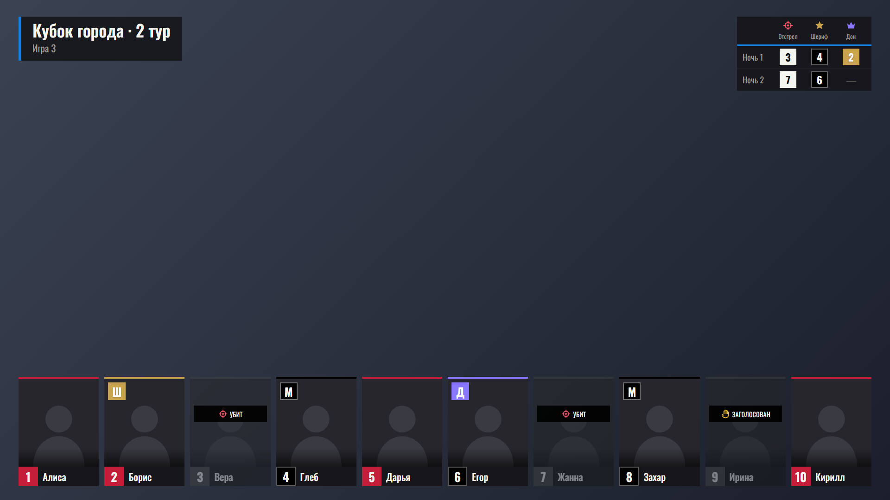
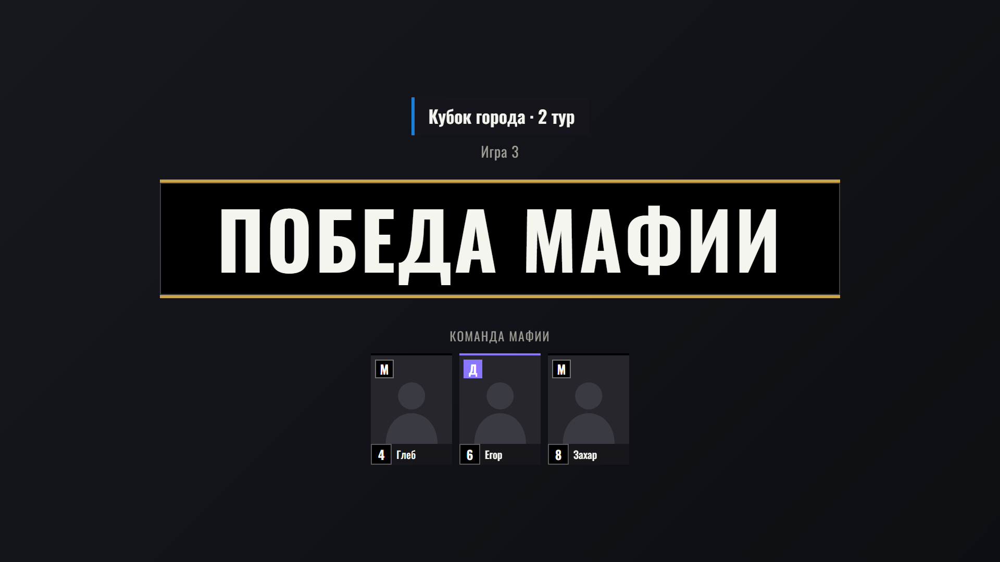
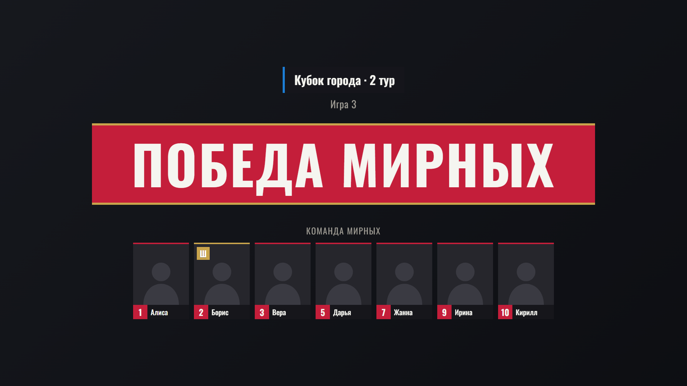

# HUD для спортивной мафии · OBS

Оверлей для трансляции любого турнира по спортивной мафии: плашки 10 игроков с фото и ролями, таблица ночей (отстрелы и проверки) и сцены победы. Название турнира и номер игры задаются в пульте, в коде они не зашиты. Управление идёт из отдельной страницы, **пульта**.

## Как это выглядит

**Оверлей** (поверх камеры в OBS). Слева сверху название турнира и номер игры, справа сверху таблица ночей, внизу плашки игроков. Убитые и заголосованные игроки затемнены:

**Победа мафии** (`win-mafia.html`). Показываются карточки игроков команды мафии с ролями:

**Победа мирных** (`win-civilians.html`):

## Файлы

| Файл | Что это |
|---|---|
| `mafia-hud.html` | Основной файл: оверлей (поверх камеры) и пульт (`#panel`) |
| `win-civilians.html` | Сцена «Победа мирных» |
| `win-mafia.html` | Сцена «Победа мафии» |

Код во всех трёх файлах одинаковый, отличается только строка `FORCE_MODE`. Если правите код, вносите те же изменения во все три файла.

## Установка

Нужны OBS Studio 28 или новее

### 1. Включите WebSocket в OBS

«Инструменты» → «Настройки сервера WebSocket» → «Включить сервер WebSocket». Порт по умолчанию 4455. Пароль можно оставить включённым, тогда его нужно будет ввести в пульте.

### 2. Добавьте источники в OBS

Для каждого файла создайте источник **«Браузер»**:

- поставьте галочку «Локальный файл» и выберите нужный `.html`;
- пользовательский CSS, который OBS подставляет по умолчанию, можно оставить: фон оверлея и так прозрачный.

Рекомендуемый порядок сцен:

1. `mafia-hud.html` — оверлей поверх камеры, постоянно включён;
2. `win-civilians.html` и `win-mafia.html` — отдельные сцены (или источники), которые вы включаете в конце игры.

Пока пульт не отправил данные, оверлей пустой. Если открыть его в обычном браузере, он покажет подсказку.

### 3. Откройте пульт

Откройте `mafia-hud.html#panel` в обычном браузере (Chrome, Edge) или нажмите «Открыть пульт» на подсказке. Лучше всегда пользоваться одним и тем же браузером и профилем: фото и настройки хранятся в нём, а не в файле.

В блоке «Связь с OBS» должно быть «Подключено к OBS». Если нет, проверьте адрес и порт (по умолчанию `localhost`, `4455`), введите пароль и нажмите «Подключить». Внизу блока показано, какие экраны уже отозвались: HUD, победа мирных, победа мафии. Состояние не теряется при перезапуске OBS: пульт отправит данные заново, как только связь восстановится.

## Как проводить игру

1. **Игроки турнира.** В блоке «Игроки турнира» добавьте ники: по одному кнопкой «Добавить игрока» или списком, по нику в строке. Фото загружается кнопкой «+» рядом с ником (изображение обрезается до 3:4 автоматически).
2. **Рассадка.** В блоке «Рассадка на игру» выберите игрока на каждое место и назначьте роль: мирный, шериф, мафия, дон.
3. **Ночи.** В блоке «Ночи: отстрел и проверки» выберите, кого убила мафия, кого проверил шериф и кого проверил дон. Как только в последней ночи появилось любое действие, добавляется следующая ночь.
   - Игрок, указанный в отстреле, становится убитым автоматически.
   - Проверка шерифа на экране показывается цветом номера: красный или чёрный.
   - Проверка дона: жёлтый номер означает, что дон нашёл шерифа, серый — не нашёл.
   - Ночь, в которой нет ни одного действия, на экране не показывается. Кнопка «×» удаляет ночь.
4. **Голосование.** Заголосованного игрока отметьте в рассадке в колонке «Статус» → «Заголосован». На плашке появится «ЗАГОЛОСОВАН», а сама плашка станет серой.
5. **Конец игры.** Включите в OBS нужную сцену победы. На ней показываются карточки всех игроков победившей команды с ролями.
6. **Следующая игра.** Кнопка «Новая игра» сбрасывает роли, статусы и ночи и увеличивает номер игры. Рассадка остаётся. Номер игры можно поправить вручную в блоке «Название турнира» (0 скрывает надпись).

## Размеры плашек

Блок «Размеры плашек» меняет оверлей сразу:

- высота плашек игроков и размер подписей на них;
- промежуток между плашками, отступ от низа и от краёв;
- размер таблицы ночей и плашки с названием турнира.

«Сбросить размеры» возвращает значения по умолчанию. Результат удобно смотреть в «Превью оверлея» (в OBS превью лучше не включать).

## Цвет турнира

В блоке «Название турнира» выберите акцентный цвет: один из готовых кружков или любой свой через поле цвета. «Сбросить» возвращает красный. Цвет окрашивает полоску у названия, линию под шапкой таблицы ночей и заголовок на сценах. Цвета команд (красные, чёрные) и роли (шериф, дон) не меняются, чтобы зрители не путались. На картинке выше выбран синий.

## Если что-то не работает

| Проблема | Что делать |
|---|---|
| «Нет связи с OBS» | Включите сервер WebSocket в OBS, проверьте порт 4455 и то, что OBS запущен |
| «OBS просит пароль» / «Неверный пароль» | Введите пароль из «Инструменты → Настройки сервера WebSocket → Показать сведения о подключении» или отключите аутентификацию |
| Оверлей в OBS пустой | Подключен ли пульт, и отозвался ли «HUD» в списке экранов. После правок файла обновите страницу источника (правый клик → «Обновить кэш браузера») |
| Фото не сохранилось | Закончилось место в хранилище браузера: удалите лишних игроков или загрузите фото поменьше |
| Пропали игроки и фото | Вы открыли пульт в другом браузере или профиле. Данные лежат в `localStorage` того браузера, где работали раньше |
| Шрифты выглядят иначе | Нет доступа к Google Fonts, подключитесь к интернету |

## Для разработчиков

- Весь код каждого файла лежит внутри одного HTML, сборки нет.
- Режим выбирается по адресу: без суффикса — оверлей, `#panel` или `?panel` — пульт, `#red` и `#black` — сцены победы (в файлах сцен режим зашит в `FORCE_MODE`), `#wait` — заставка ожидания с названием и номером игры.
- Пульт передаёт состояние оверлею через WebSocket-сервер OBS (событие `BroadcastCustomEvent`), а между вкладками одного браузера дополнительно через `BroadcastChannel`.
- Адрес, порт и пароль можно задать в ссылке: `?host=…&port=…&pw=…`.
